# LM Player 

LM Player is Full Stack application to play your music through the Web.

- Backend: Express.js
- Client: React+Tanstack Router

## Desktop

**Home Page**

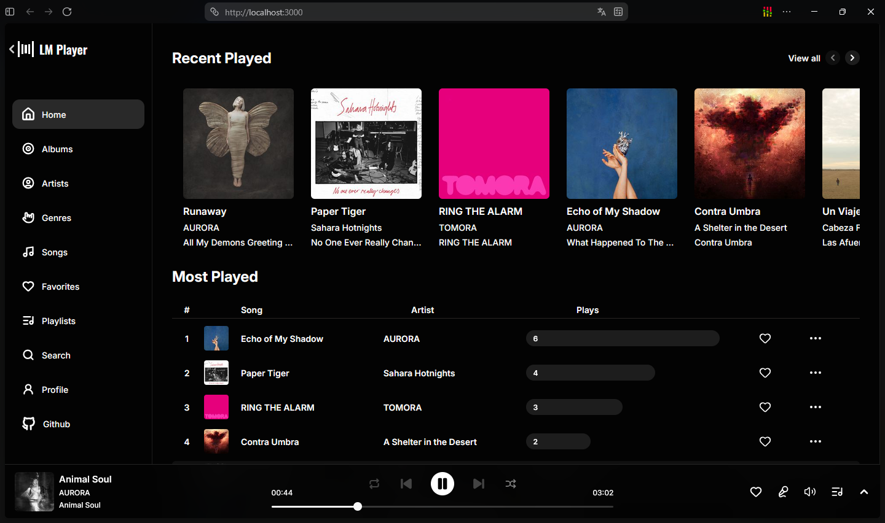

**All Artists Page**

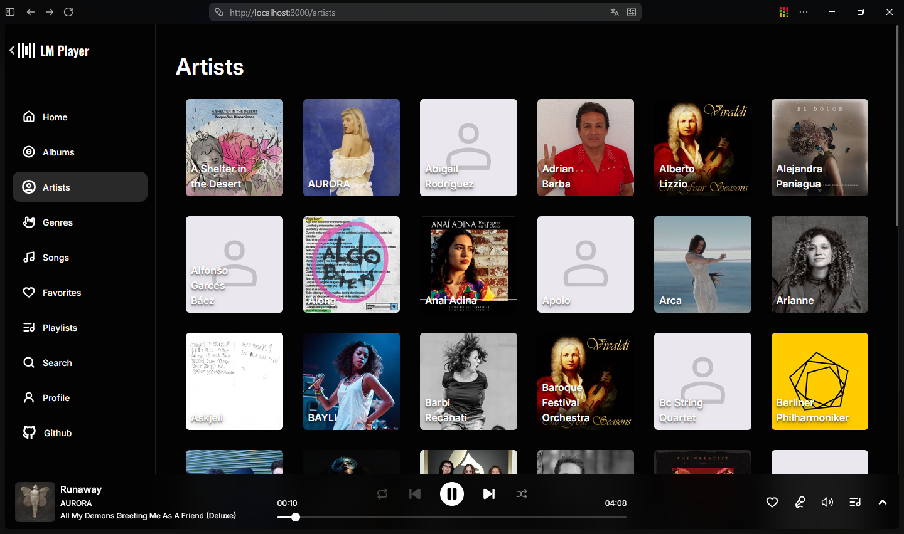

**Artist Page**

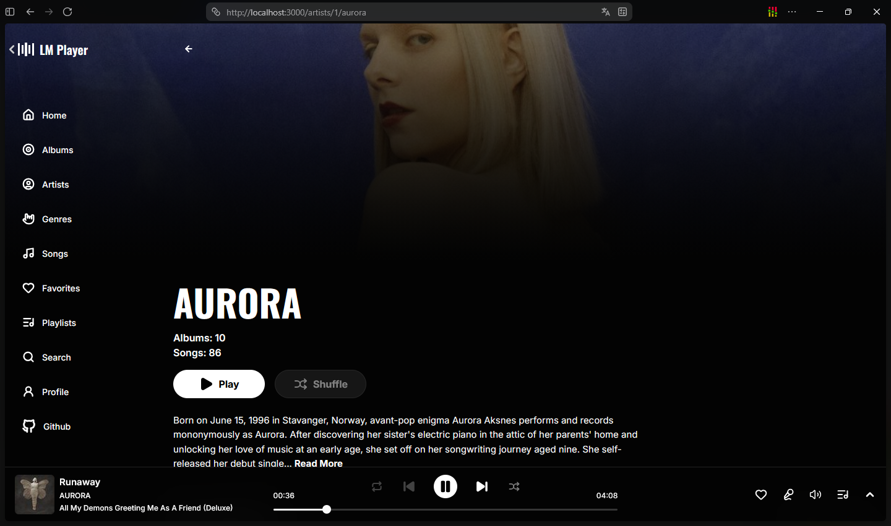

**Album Page**

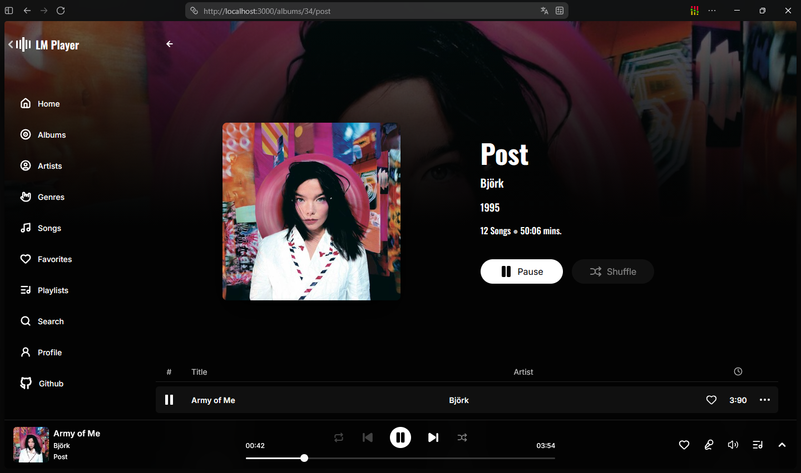

**Player Queue**

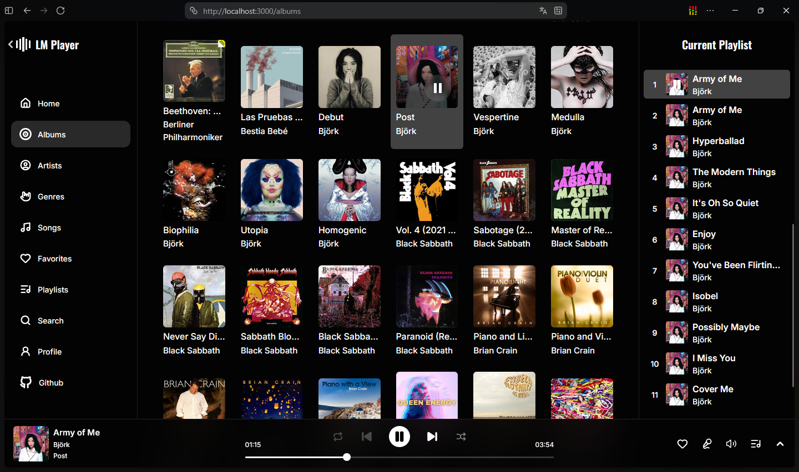

**Full Screen Player**

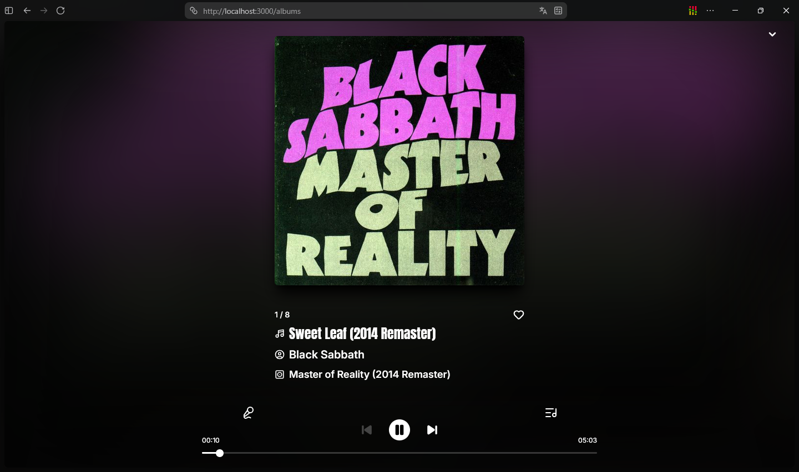

## Mobile

**Home Page**

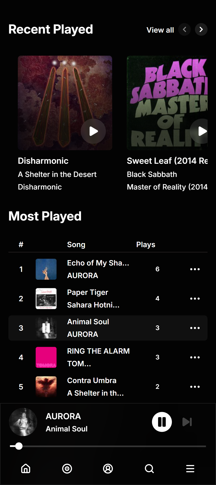

**Albums Page**

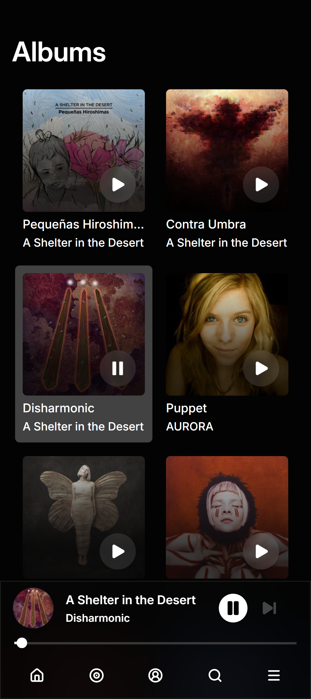

**Artist Page**

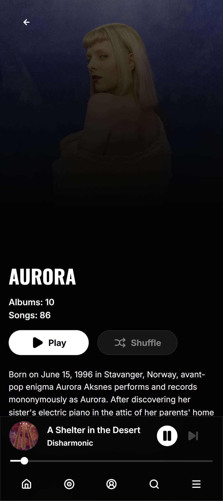

**Album Page**

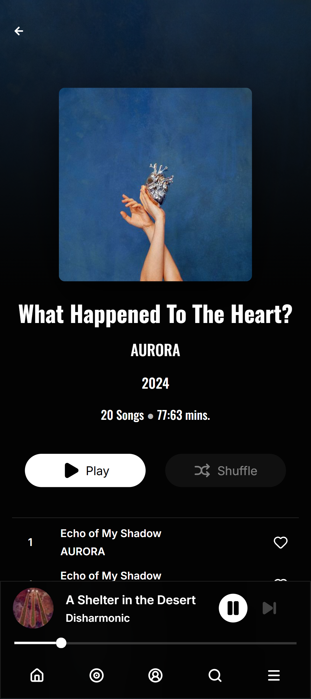

**Full Screen Player**

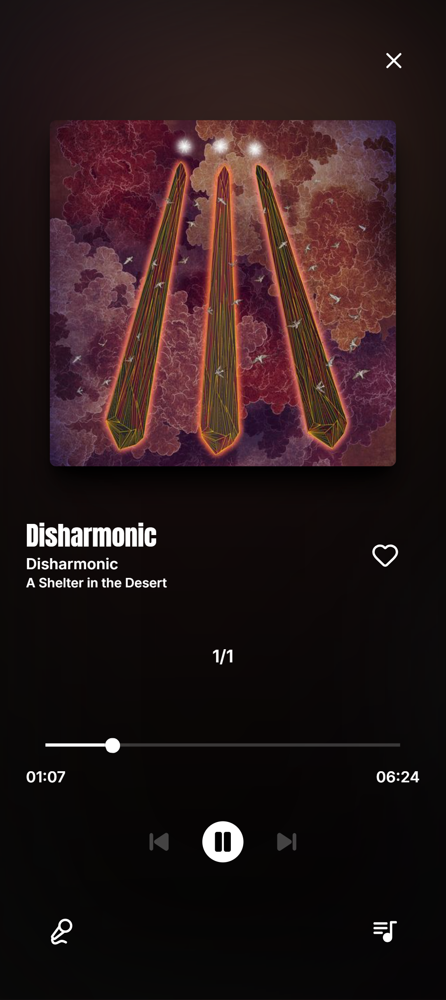
